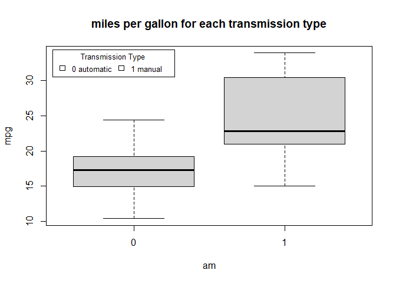
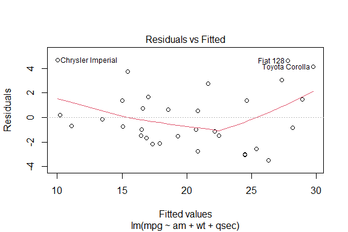
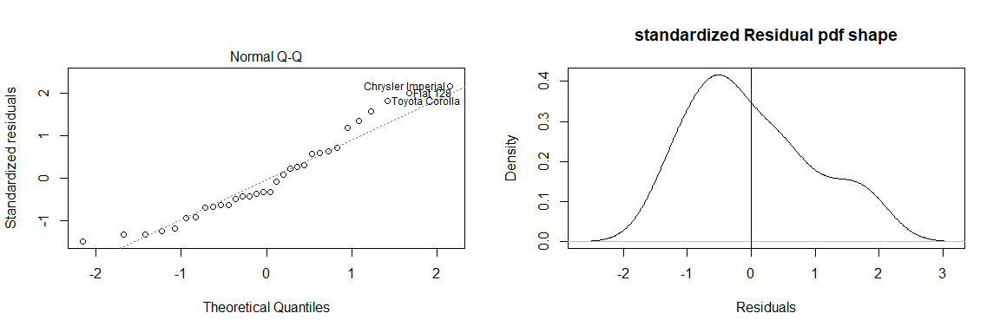
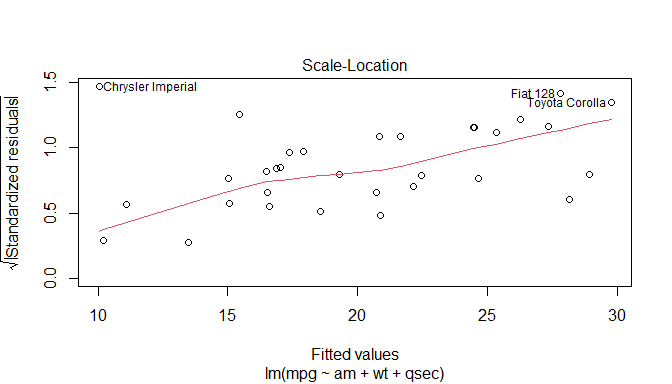
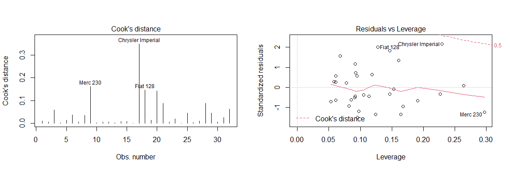
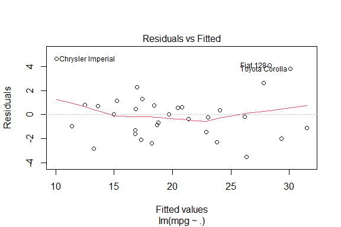
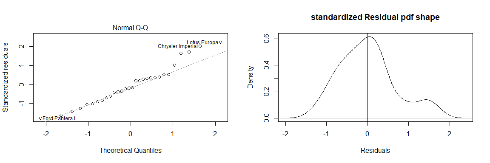
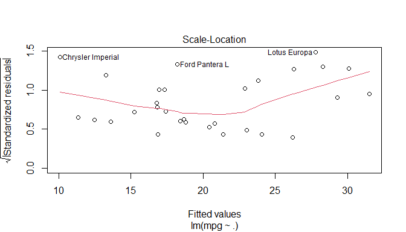

---
Effect of transmission type on fuel efficiency for cars based on mtcars data
---

#### view on on rpub: [Effect of transmission type on fuel efficiency for cars based on mtcars data](https://rpubs.com/Amrabdelhamed611/674974)

## Executive Summary

In this report, mtcars data set will be analyzed, to explore the relationship between a the variables and Miles Per Gallon(MPG). The data was extracted from the 1974 Motor Trend US magazine, and comprises fuel consumption and 10 aspects of automobile design and performance for 32 automobiles (1973–74 models).

Regression models and exploratory data analyses are used to mainly explore how automatic (am = 0) and manual (am = 1) transmissions features affect the MPG feature. T-test shows that the performance difference between cars with automatic and manual transmission. And it is about 7 MPG more for cars with manual transmission than those with automatic transmission. Then, several linear regression models are fitted with lowest AIC and with lowest deviance values is selected. So, given that weight and 1/4 mile time are held constant.

## Explortory analysis

from the help(mtcars) we get the data **Description**:
The data was extracted from the 1974 Motor Trend US magazine, and comprises fuel consumption and 10 aspects of automobile design and performance for 32 automobiles (1973–74 models).

and **variables names** data frame with 32 observations on 11 (numeric) variables:

* [, 1]	mpg	Miles/(US) gallon.
* [, 2]	cyl	Number of cylinders.
* [, 3]	disp	Displacement (cu.in.).
* [, 4]	hp	Gross horsepower.
* [, 5]	drat	Rear axle ratio.
* [, 6]	wt	Weight (1000 lbs).
* [, 7]	qsec	1/4 mile time.
* [, 8]	vs	Engine (0 = V-shaped, 1 = straight).
* [, 9]	am	Transmission (0 = automatic, 1 = manual).
* [,10]	gear	Number of forward gears.
* [,11]	carb	Number of carburetors.

check categorical variables to factorize them. 

```r
lapply(mtcars, unique,axis =  1 )
```

```
## $mpg
##  [1] 21.0 22.8 21.4 18.7 18.1 14.3 24.4 19.2 17.8 16.4 17.3 15.2 10.4 14.7 32.4
## [16] 30.4 33.9 21.5 15.5 13.3 27.3 26.0 15.8 19.7 15.0
## 
## $cyl
## [1] 6 4 8
## 
## $disp
##  [1] 160.0 108.0 258.0 360.0 225.0 146.7 140.8 167.6 275.8 472.0 460.0 440.0
## [13]  78.7  75.7  71.1 120.1 318.0 304.0 350.0 400.0  79.0 120.3  95.1 351.0
## [25] 145.0 301.0 121.0
## 
## $hp
##  [1] 110  93 175 105 245  62  95 123 180 205 215 230  66  52  65  97 150  91 113
## [20] 264 335 109
## 
## $drat
##  [1] 3.90 3.85 3.08 3.15 2.76 3.21 3.69 3.92 3.07 2.93 3.00 3.23 4.08 4.93 4.22
## [16] 3.70 3.73 4.43 3.77 3.62 3.54 4.11
## 
## $wt
##  [1] 2.620 2.875 2.320 3.215 3.440 3.460 3.570 3.190 3.150 4.070 3.730 3.780
## [13] 5.250 5.424 5.345 2.200 1.615 1.835 2.465 3.520 3.435 3.840 3.845 1.935
## [25] 2.140 1.513 3.170 2.770 2.780
## 
## $qsec
##  [1] 16.46 17.02 18.61 19.44 20.22 15.84 20.00 22.90 18.30 18.90 17.40 17.60
## [13] 18.00 17.98 17.82 17.42 19.47 18.52 19.90 20.01 16.87 17.30 15.41 17.05
## [25] 16.70 16.90 14.50 15.50 14.60 18.60
## 
## $vs
## [1] 0 1
## 
## $am
## [1] 1 0
## 
## $gear
## [1] 4 3 5
## 
## $carb
## [1] 4 1 2 3 6 8
```
Form unique values we can know which variables are the categorical variables.

```r
mtcars$cyl <-as.factor( mtcars$cyl)
mtcars$vs <-as.factor( mtcars$vs)
mtcars$carb <-as.factor( mtcars$carb)
mtcars$am <-as.factor( mtcars$am)
mtcars$gear <-as.factor( mtcars$gear)
```
check the summary for changes

```r
summary(mtcars)
```

```
##       mpg        cyl         disp             hp             drat      
##  Min.   :10.40   4:11   Min.   : 71.1   Min.   : 52.0   Min.   :2.760  
##  1st Qu.:15.43   6: 7   1st Qu.:120.8   1st Qu.: 96.5   1st Qu.:3.080  
##  Median :19.20   8:14   Median :196.3   Median :123.0   Median :3.695  
##  Mean   :20.09          Mean   :230.7   Mean   :146.7   Mean   :3.597  
##  3rd Qu.:22.80          3rd Qu.:326.0   3rd Qu.:180.0   3rd Qu.:3.920  
##  Max.   :33.90          Max.   :472.0   Max.   :335.0   Max.   :4.930  
##        wt             qsec       vs     am     gear   carb  
##  Min.   :1.513   Min.   :14.50   0:18   0:19   3:15   1: 7  
##  1st Qu.:2.581   1st Qu.:16.89   1:14   1:13   4:12   2:10  
##  Median :3.325   Median :17.71                 5: 5   3: 3  
##  Mean   :3.217   Mean   :17.85                        4:10  
##  3rd Qu.:3.610   3rd Qu.:18.90                        6: 1  
##  Max.   :5.424   Max.   :22.90                        8: 1
```
### Explore the relation between transmission type (AM) and miles per gallon (MPG)

```r
boxplot(mpg ~ am,data = mtcars)
title(main ="miles per gallon for each transmission type")
legend("topleft", inset=.02, title="Transmission Type",c("0 automatic","1 manual"), fill=topo.colors(0), horiz=TRUE, cex=0.8)
```



The plot shows the mpg mean of the manual transmission is higher then automatic transmission ,and can use two tail t test to verify it.

```r
t.test(mtcars$mpg ~ mtcars$am, alternative = "two.sided", var.equal = FALSE)
```

```
## 
## 	Welch Two Sample t-test
## 
## data:  mtcars$mpg by mtcars$am
## t = -3.7671, df = 18.332, p-value = 0.001374
## alternative hypothesis: true difference in means is not equal to 0
## 95 percent confidence interval:
##  -11.280194  -3.209684
## sample estimates:
## mean in group 0 mean in group 1 
##        17.14737        24.39231
```

The mean of the manual transmission is more then The mean of automatic transmission with approximate 7 miles per gallons but if we take that finding without any further investigations will be too hasty and there another variables in the data has effect on miles per gallons so fitting models will help explore the relation between variable 

## Model fitting

using the AIC to chose best model fit : 

```r
model1 <- lm(mpg ~ am+ disp+ wt+ cyl+ drat +gear +qsec +vs +carb + hp, data = mtcars) 
modl1 <- step(model1 ,trace = FALSE , k = log(nrow(mtcars) ))
```
using `trace = false` to hide step output as it very long and store the lowest AIC model in `modl1`. 

using `model$anova` to preview model selection process and which variables has effect on AIC we excluded. 

```r
modl1$anova
```

```
##     Step Df   Deviance Resid. Df Resid. Dev       AIC
## 1        NA         NA        15   120.4027 101.32090
## 2 - carb  5 13.5988573        20   134.0015  87.41652
## 3 - gear  2  5.0215145        22   139.0230  81.66228
## 4  - cyl  2 10.4247254        24   149.4478  77.04464
## 5   - vs  1  0.6454862        25   150.0933  73.71682
## 6 - drat  1  3.3445512        26   153.4378  70.95632
## 7 - disp  1  6.6286537        27   160.0665  68.84398
## 8   - hp  1  9.2194693        28   169.2859  67.17025
```
The `-` in each row mean eliminating associated variable in second row `-carb` means eliminating variable `carb` from the model this lower the AIC to `87.4` so we the best AIC `67.1` after eliminate `hp`.

The deviance also increase and that bad sign, so will fit two model one with lowest deviance and one with lowest AIC and use coefficients and diagnostics plots to reach to best fit.

**Examining the model `model1` with lowest deviance:**
variables and coefficients of the model.

```r
model1 <- lm(mpg ~ ., data = mtcars)
summary(model1)$call; summary(model1)$coef
```

```
## lm(formula = mpg ~ ., data = mtcars)
```

```
##                Estimate  Std. Error     t value   Pr(>|t|)
## (Intercept) 23.87913244 20.06582026  1.19004018 0.25252548
## cyl6        -2.64869528  3.04089041 -0.87102622 0.39746642
## cyl8        -0.33616298  7.15953951 -0.04695316 0.96317000
## disp         0.03554632  0.03189920  1.11433290 0.28267339
## hp          -0.07050683  0.03942556 -1.78835344 0.09393155
## drat         1.18283018  2.48348458  0.47627845 0.64073922
## wt          -4.52977584  2.53874584 -1.78425732 0.09461859
## qsec         0.36784482  0.93539569  0.39325050 0.69966720
## vs1          1.93085054  2.87125777  0.67247551 0.51150791
## am1          1.21211570  3.21354514  0.37718957 0.71131573
## gear4        1.11435494  3.79951726  0.29328856 0.77332027
## gear5        2.52839599  3.73635801  0.67670068 0.50889747
## carb2       -0.97935432  2.31797446 -0.42250436 0.67865093
## carb3        2.99963875  4.29354611  0.69863900 0.49546781
## carb4        1.09142288  4.44961992  0.24528452 0.80956031
## carb6        4.47756921  6.38406242  0.70136677 0.49381268
## carb8        7.25041126  8.36056638  0.86721532 0.39948495
```

```r
deviance(model1)
```

```
## [1] 147.4944
```
interpret some variable when holding the other variables as constants:

* the Intercept is **am0 ,cyl4,vs0*,gear3** coefficient with value `23.88` means the associated coefficient has `23.88` Miles per gallon (MPG).
* **am1** coefficient with value `1.21` means the manual Transmission has `25.091` Miles per gallon (MPG).
* **wt** for each 1000 lbs increase in vehicle weight the (MPG) decreases with `4.52`.
* **qsec** for 1/4 mile time increases by unit time (second) the (MPG) increases with `1.2` 
* **carb 2,3,4,6,8** has huge impact on MPG first if car with `carb2` will lower the `MPG` but with each increase in `carb` increase MPG rapidly.

**Examining the model `modl1` with lowest AIC:**

variables and coefficients of the model.

```r
summary(modl1)$call; summary(modl1)$coef
```

```
## lm(formula = mpg ~ am + wt + qsec, data = mtcars)
```

```
##              Estimate Std. Error   t value     Pr(>|t|)
## (Intercept)  9.617781  6.9595930  1.381946 1.779152e-01
## am1          2.935837  1.4109045  2.080819 4.671551e-02
## wt          -3.916504  0.7112016 -5.506882 6.952711e-06
## qsec         1.225886  0.2886696  4.246676 2.161737e-04
```

```r
deviance(modl1)
```

```
## [1] 169.2859
```
the model with 3 variables `am + wt + qsec` , interpret each variable when holding the other variables as constants:

* the Intercept is **am0** coefficient with value `9.6` means the automatic Transmission has mean`9.6` Miles per gallon (MPG).
* **am1** coefficient with value `2.9` means the manual Transmission has mean `12.55` Miles per gallon (MPG).
* **wt** for each 1000 lbs increase in vehicle weight the (MPG) decreases with `3.9`.
* **qsec** for 1/4 mile time increases by unit time (second) the (MPG) increases with `1.2`

## Residual plot for diagnostics

Since regression  based on certain assumptions. Regression diagnostics used to evaluate
the model assumptions and investigate whether holds or not.

### **Residuals plots for the model with lowest AIC `modl1`:**

Residuals vs fitted values plot: to check linearity assumption

```r
plot(modl1,which = 1)
```



The linearity assumption dose not hold as the red line is not approximate to the dashed line in the graph, means the mean of residues is varies.

The normal QQ and standardized shape of residuals to check the residuals normality.

```r
par(mfrow = c(1, 2))
plot(modl1,which = 2)
resdulpdf<-density(modl1$residuals /summary.lm(modl1)$sigma)
plot(resdulpdf,main='standardized Residual pdf shape',xlab='Residuals')
abline(v = 0)
```



the residuals is approximate to normality but the curve shifted as the peek between zero and one.

The Scale-location plot to check the Homoscedasticity.

```r
par(mfrow = c(1, 1))
plot(modl1,which = 3)
```



variance around the line The spread of standardized residuals around the red line doesn’t vary
with respect to the fitted values,Homoscedasticity holds.

we can also verify our finding by using bptest from lmtest library,the bptest function test the hypothesis of homoskedasticity.


```r
bptest(modl1)
```

```
## 
## 	studentized Breusch-Pagan test
## 
## data:  modl1
## BP = 6.1871, df = 3, p-value = 0.1029
```

the p-value is bigger then .05 so the assumption of homoskedasticity is holding as we expected.

The cook's distance and residuals vs leverage to spot the outliers

```r
par(mfrow = c(1, 2))
plot(modl1,which = c(4,5))
```



from plots the data dose not contain any outliers.

so diagnostic conclusion for this model we need model contains interactions between variables or polynomial terms but first lets do same diagnostics for the model with lowest deviance.

### **Residuals plots for the model with lowest variance `model1`:**

Residuals vs fitted values plot: to check linearity assumption:

```r
plot(model1,which = 1)
```



The linearity assumption holds as the red line is approximate to the dashed line in the graph, but we can see some point of residual far away from the others.

The normal QQ and standardized shape of residuals to check the residuals normality:

```r
par(mfrow = c(1, 2))
plot(model1,which = 2)
```

```
## Warning: not plotting observations with leverage one:
##   30, 31
```

```r
resdulpdf<-density(model1$residuals /summary.lm(model1)$sigma)
plot(resdulpdf,main='standardized Residual pdf shape',xlab='Residuals')
abline(v = 0)
```



The residuals is approximate to normality but the curve between 2 standard deviations that violate the standardized residuals as approximately 99.9% between 3 standard deviations.

The Scale-location plot to check the Homoscedasticity.

```r
par(mfrow = c(1, 1))
plot(model1,which = 3)
```

```
## Warning: not plotting observations with leverage one:
##   30, 31
```



variance is constant around the line,Homoscedasticity is holding.


```r
bptest(model1)
```

```
## 
## 	studentized Breusch-Pagan test
## 
## data:  model1
## BP = 18.294, df = 16, p-value = 0.307
```
the p-value is less then .05 so the assumption of homoskedasticity is holding as we expected.

The cook's distance and residuals vs leverage to spot the outliers but the model assumptions are violated so the outliers analysis dose not matter as the model is poorly fit.

so diagnostic conclusion for this model the model has low deviance but the Regression model assumptions violated.

based from the finding from the two models and mean test the manual transmissions has higher miles per gallon so the manual transmissions and is better for saving fuel.

